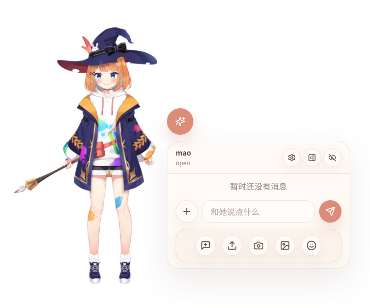

# Lunaria

[English](./README.md)

Lunaria 是一个基于 Live2D 的桌面角色项目，目标是通过 Live2D 模型对接 OpenClaw。当前仓库包含 Python 后端、Web 原型前端和 Electron 桌面前端。

项目目前仍处于持续开发阶段，但已经具备基础可运行能力，包括模型加载、聊天、SSE 事件流、动作 / 表情指令，以及 TTS 接入。




### 功能概览

- Live2D 模型加载与展示
- 聊天消息流式输出
- 表情 / 动作指令
- SSE 事件流
- OpenClaw Channel 接入
- TTS 支持：
  - `edge-tts`
  - `gpt-sovits`
- Web 前端原型
- Electron 桌面前端

### 当前状态

- 后端可运行，负责模型、聊天、事件流和 TTS
- Web 前端是早期原型，目前不建议作为主要使用方式
- Electron 前端是当前更推荐的入口
- OpenClaw Channel 已接入
- 配置结构和前端体验仍会继续调整

### 环境要求

- Python 3.11+
- Node.js 18+
- npm
- OpenClaw

如果你使用 Nix，也可以直接使用仓库中的 [shell.nix](./shell.nix)。

### 安装依赖

#### 方式 1：Python + npm

在仓库根目录安装后端依赖：

```bash
pip install -r requirements.txt
```

再安装 Electron 前端依赖：

```bash
cd desktop
npm install
cd ..
```

#### 方式 2：Nix

```bash
nix-shell
```

进入 shell 后，会得到项目后端当前使用的 Python 运行环境。

### 配置

项目默认从根目录读取 `config.json`。

如果你希望从示例配置开始：

```bash
cp config.example.json config.json
```

通常需要根据本地环境调整以下项目：

- `server.host`
- `server.port`
- `desktop.backendUrl`
- `chat.providers`
- `chat.tts`
- `models`

### 运行后端

后端入口如下：

```bash
python3 run.py
```

默认监听地址：

```text
http://127.0.0.1:18080
```

### Web 前端

仓库中包含一个 Web 前端。后端启动后，通常可以直接通过浏览器访问。

不过需要说明的是，这个 Web 前端目前主要用于调试和验证流程：

- 它是早期原型
- 仍存在较多已知问题
- 不建议作为主要使用方式

如果你的目标是确认接口是否连通、模型是否正常加载，它仍然是有帮助的。

### Electron 前端

Electron 前端是当前更推荐的使用方式。

安装依赖：

```bash
cd desktop
npm install
```

开发模式启动：

```bash
npm run dev
```

如果你希望本地构建并预览：

```bash
npm run build
npm start
```

说明：

- Electron 前端默认仍会连接后端
- 因此前端启动前，通常需要先启动后端
- 默认后端地址来自 `config.json` 中的 `desktop.backendUrl`

### OpenClaw Channel

Lunaria 当前支持连接 OpenClaw Channel。

先在 OpenClaw 中安装并启用插件：

```bash
openclaw plugins install Lunaria/openclaw-channel-live2d
openclaw plugins enable live2d
openclaw gateway restart
```

然后在 `config.json` 中配置对应 provider，例如：

```json
{
  "chat": {
    "defaultProviderId": "live2d-channel",
    "providers": [
      {
        "id": "live2d-channel",
        "type": "openclaw-channel",
        "name": "OpenClaw Channel",
        "bridgeUrl": "ws://127.0.0.1:18081",
        "agent": "main",
        "session": "live2d:direct:desktop-user"
      }
    ]
  }
}
```

### TTS

当前支持两类 TTS：

- `edge-tts`
- `gpt-sovits`

相关配置位于 `config.json` 的 `chat.tts`。

#### edge-tts

适合优先用于本地快速跑通。

#### gpt-sovits

如果你已经有现成的 GPT-SoVITS 服务，可以通过 `baseUrl`、`model`、`voice` 等配置接入。

### 目录结构

- `backend/`: Python 后端
- `frontend/`: Web 前端
- `desktop/`: Electron 前端
- `models/`: Live2D 模型资源
- `openclaw-channel-live2d/`: OpenClaw Channel 插件
- `config.json`: 主配置文件
- `run.py`: 后端启动入口
